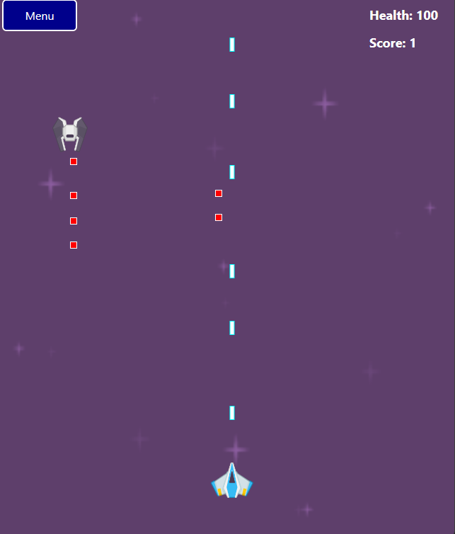

# Space Battle Shooter 🚀🚀🚀



## Introduction
**Space Battle Shooter** is an exciting 2D space shooter game developed in C#. In this game, you control a spaceship and battle against space enemies. The game features beautiful 2D graphics, lively sound effects, and challenging levels.

## Features
- Stunning 2D graphics
- Engaging sound effects
- Multiple challenging levels
- Various weapons and upgrades
- High score leaderboard

## Installation
1. Clone this repository:
    ```bash
    git clone https://github.com/LeThanhCong1506/SpaceBattleShooter.git
    ```
2. Open the project in Visual Studio.
3. Build and run the project.

## How to Play
- Use the arrow keys to control the spaceship.
- Destroy enemies and avoid obstacles.

## Contact
If you have any questions, feel free to contact us via email: [thanhcongle666@gmail.com](mailto:thanhcongle666@gmail.com).


You can view the latest commits [here](https://github.com/LeThanhCong1506/SpaceBattleShooter/commits/main).
